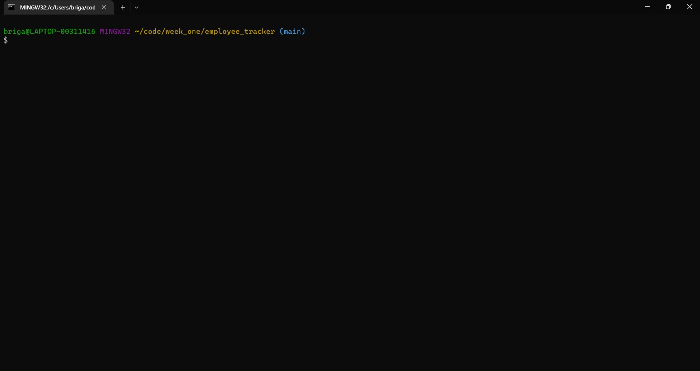

# Database Management - Employee Tracker

## Description
The purpose of this project is to execute CRUD operations on a database of departments, roles, and employees. I've learned how frustrating it is using inquirer and the mysql2 node package. 

## Installation
Go to your terminal, in the root direcory of the project, and run `npm i`. That will download the node packages necessary to run the application. Then run `node index.js` at the root directory and the application will begin with a few options.

## Usage
1. Run `node index.js` at the root directory of your project to start
2. Choose one of the options listed in your terminal.
3. Answer a few questions, and enjoy!

## Video Tutorial
Below is a video tutorial for how to use the application. If your a visual person, this one's for you!
